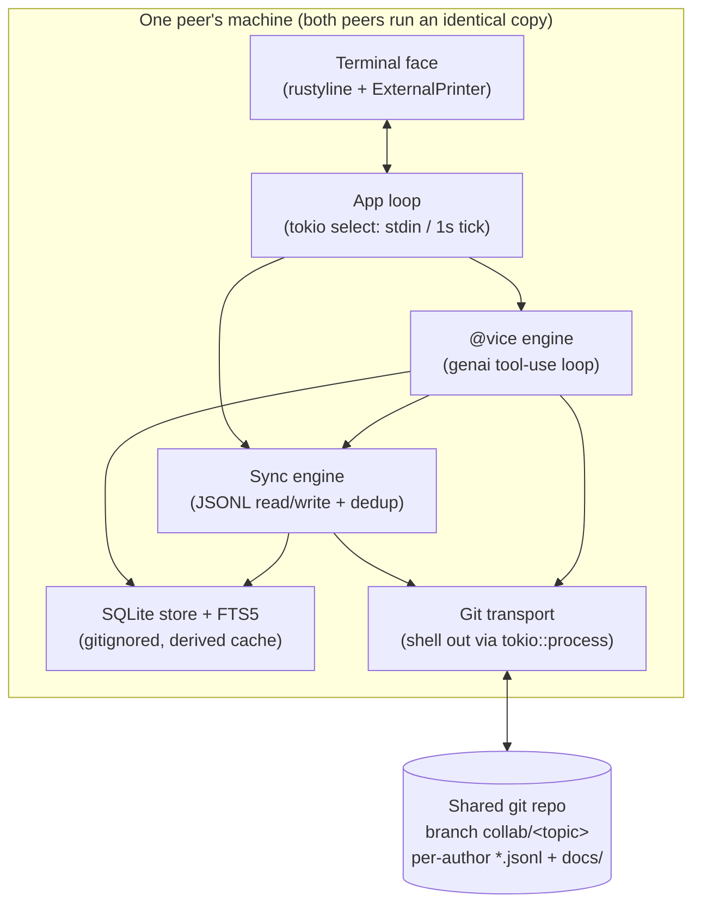
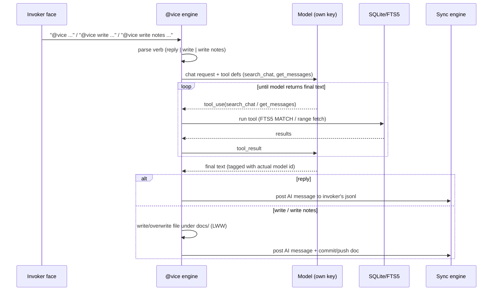

# feat: agent-collab v1 — git-transport two-human planning room with @vice AI scribe

## Summary

Build v1 of **agent-collab**: a single Rust terminal program each of two developers runs locally. There is no server. Two humans chat during architecture/planning deliberation; the only shared thing is a git repo. Each peer's program writes its own messages to a per-author file on a `collab/<topic>` branch, pushes, and polls (~1s) for the other peer's pushes. A gitignored local SQLite store with FTS5 gives full-text recall. `@vice` invokes an AI (any OpenAI-compatible provider or Anthropic) on the *invoker's own machine and key* — acting as scribe (writes/updates summary docs), memory (searches past chat), and researcher. The AI gets two tools — `search_chat` and `get_messages` — and runs a tool-use loop.

v1 is **all-Rust with a thin text face** (scrolling log + one editable prompt line). The GUI (Tauri) and multi-provider polish are explicitly **follow-on milestones**, not built here. Every architectural decision was locked in a prior grill (see `origin: memory/agent-collab-spec.md`).

---

## Problem Frame

Two developers planning an architecture talk a lot, reference earlier decisions, and want an AI present to write things down, recall what was said, and look things up — without one person screen-sharing their single AI session. Existing options (Discord call + one person's Claude Code) make the AI private to one human and lose the written record. agent-collab makes the conversation + AI artifacts a shared, durable, git-versioned record that both peers own equally, works async (offline peers catch up on pull), and lets each peer bring their own model and key.

**Why git-as-transport:** eliminates a relay/signaling server entirely. Late-join, reconnect, and offline replay all fall out of `git pull` for free. The cost — a few seconds of lag (walkie-talkie feel) — is acceptable for deliberation, which is not low-latency chat.

---

## Requirements

Traced from `origin: memory/agent-collab-spec.md` (15 locked nodes). R-IDs are plan-local.

- **R1** — Chat stored in a local **SQLite** store, **gitignored** (binary can't merge → must be gitignored).
- **R2** — Sync via **git-as-transport**: per-author message files pushed to a shared repo; both peers poll/pull. No relay/server.
- **R3** — **Push-on-send**; poll/pull every ~1s. Push collision → **auto pull-rebase-retry** (per-author files never content-clash).
- **R4** — Room = repo + branch **`collab/<topic>`**; access control = git push rights; `main` kept clean.
- **R5** — Join (v1) = clone repo + run CLI with the branch name. No shared host. (GUI later adds share-links/rooms.)
- **R6** — Author identity = git `user.name` / `user.email`; no separate login.
- **R7** — AI trigger **`@vice`**: `@vice <x>` = read-only reply in thread; `@vice write <x>` = file write; `@vice write notes <x>` = scribe doc.
- **R8** — Provider/model/key from a **gitignored per-repo config file**, with a **global default fallback**. No inline per-call override in v1.
- **R9** — `@vice` runs on the **invoker's machine with the invoker's own key** (read from a local env var; nothing stored by the tool). No proxy/shared billing.
- **R10** — AI message **tagged by the actual model used** (claude / deepseek / qwen / …), not hardcoded "claude".
- **R11** — AI gets tools `search_chat(query)` (SQLite FTS5 keyword) + `get_messages(range)`; corpus = all sessions; **no embeddings** in v1 (documented upgrade path).
- **R12** — Meaning layer = scribe docs searched alongside raw messages + free metadata (author/time/kind) + optional human `#hashtags`. No per-message classifier.
- **R13** — Corrections = plain chat, not a protocol.
- **R14** — Scribe docs written to `docs/` + explicit path, **update-in-place**, auto-commit+push to the collab branch. Conflict = **LWW (last-write-wins)** for v1.
- **R15** — Build order: **v1 = this plan** (CLI: git chat + SQLite + `@vice` + FTS5) → verify → GUI (Tauri) → multi-provider polish.

---

## Key Technical Decisions

- **KTD1 — Language: Rust throughout.** v1 ships as an all-Rust binary with a thin text face. Rationale: the immediate next milestone is Tauri, whose backend is Rust — the v1 chat engine, SQLite layer, and git logic carry into the GUI with zero rewrite. Trade-off (slower to write the loop than TS/Python) accepted because it buys no-rewrite at the GUI step. (see origin)

- **KTD2 — Git transport: shell out to the installed `git`.** Use `tokio::process::Command`, not `git2`/`gix`. Rationale: shelling inherits the user's git config, credential helper, and SSH agent for free (gix/git2 force reimplementing auth); matches "git is the messenger"; minimal code. Trade-off: requires `git` on PATH — guaranteed for a dev tool. (see origin)

- **KTD3 — SQLite via `rusqlite` 0.40 with the `bundled` feature.** `bundled` statically compiles SQLite into the binary (FTS5 included unconditionally — there is **no separate `fts5` feature**, and `bundled-full` is unnecessary). End users need no system SQLite; build machine needs a C compiler. Consistent SQLite across platforms (notably Windows).

- **KTD4 — LLM access: one unified crate (`genai`), multi-provider via config.** `genai` 0.6.5 exposes a single `Client`, picks provider from the model string, supports custom base URLs (`ServiceTargetResolver`) and a manual tool-use loop that matches the CLI shape. Rationale: DeepSeek/Qwen are OpenAI-API-compatible and OpenAI/Anthropic differ in tool-call wire shape; a unified crate collapses both code paths to one, directly serving R8/R10's "provider from config." Pin the exact version (unified LLM crates churn). **Fallback if `genai` blocks us:** two-client (`async-openai` for OpenAI-compatible + raw `reqwest`+`serde` for Anthropic) — recorded in Alternatives.

- **KTD5 — Terminal I/O: `tokio` + `rustyline` with the `external-printer` feature.** Plain async `stdout` **garbles** the user's half-typed line when the poll loop prints an incoming message — confirmed, not hypothetical. `rustyline`'s `ExternalPrinter` is the minimal correct tool (not a TUI): a scrolling log plus one editable prompt line. The poll loop prints via a `Send` printer handle; `readline` runs on its own blocking thread.

- **KTD6 — Message store = per-author append-only JSONL files; SQLite is a derived local cache.** Each peer writes only its own file (`chat/<author-hash>.jsonl`), so two peers never edit the same file → no content conflict on the collab branch. On pull, parse all author files, insert messages not already in SQLite (dedup by message id), print the new ones. This makes R1 (gitignored SQLite) and R2/R3 (conflict-free per-author sync) consistent: the git-tracked source of truth is the JSONL files; SQLite is a fast local index rebuilt from them.

- **KTD7 — FTS5 query escaping (not SQL injection).** Binding the query as a parameter protects the surrounding SQL but the bound string is still parsed as an FTS5 *expression* (`AND`/`OR`/`NEAR`/`*`/`"`/`:` are operators). User input like `say "hi` throws `fts5: syntax error`. Mitigation: wrap user input as quoted phrase literal(s), doubling embedded quotes, before binding. Per-word AND = split on whitespace, quote each, join.

- **KTD8 — Push-rejection detection via `git push --porcelain` + `LC_ALL=C`.** Exit code alone is insufficient (auth/network/hook failures are also non-zero) and stderr matching is locale-fragile. `--porcelain` emits a machine-readable per-ref line to stdout; a leading `!` with `non-fast-forward` means collision → `git pull --rebase` then retry (bounded). Any other non-zero → surface, don't loop.

- **KTD9 — Scribe-doc LWW = invoker's just-written version wins on collision.** Scribe docs (R14) are full-file overwrites committed to the collab branch. On push-reject, `git pull --rebase` with the doc resolved in favor of the local (just-written) copy. Rare-collision, regenerable-from-chat ceiling accepted for v1.

---

## High-Level Technical Design

### Component map



### Message round-trip (send + receive)

```mermaid
sequenceDiagram
    participant A as Peer A face
    participant SA as A sync engine
    participant G as git
    participant R as Shared repo
    participant SB as B sync engine
    participant B as Peer B face

    A->>SA: type line + Enter
    SA->>SA: append to chat/A.jsonl + insert SQLite
    A->>A: echo own line
    SA->>G: git add/commit chat/A.jsonl; push --porcelain
    alt push rejected (non-fast-forward)
        G->>R: pull --rebase
        G->>R: retry push
    end
    G->>R: A.jsonl updated
    loop every ~1s on B
        SB->>R: git pull --rebase
        SB->>SB: parse author files, find new ids
        SB->>B: ExternalPrinter.print(new messages)
    end
```

### @vice tool-use loop



---

## Output Structure

```text
agent-collab/
├── Cargo.toml
├── .vice.toml                  # gitignored: provider, model, base_url, api_key_env
├── src/
│   ├── main.rs                 # CLI entry, subcommands (join / start), wiring
│   ├── config.rs               # .vice.toml + global fallback + git identity
│   ├── store.rs                # SQLite open, schema, FTS5, search_chat/get_messages
│   ├── message.rs              # Message model, JSONL (de)serialize, ids
│   ├── sync.rs                 # per-author JSONL read/write, dedup, reconcile→store
│   ├── git.rs                  # shell-out wrappers: commit/push/pull/rebase/branch
│   ├── app.rs                  # tokio select loop, terminal face wiring
│   └── vice/
│       ├── mod.rs              # command parse (reply/write/write notes), dispatch
│       ├── tools.rs           # tool defs + handlers bridging to store
│       └── client.rs           # genai client from config, tool-use loop, scribe write
└── tests/
    ├── store_fts5.rs
    ├── sync_roundtrip.rs       # uses two temp clones + real git
    ├── git_push_reject.rs
    └── vice_loop.rs            # fake provider returning canned tool_call→text
```

*Scope declaration, not a constraint — the implementer may adjust layout.*

---

## Implementation Units

### U1. Project scaffold, config, and identity

**Goal:** Cargo project with pinned deps, config loading, and git-identity read — the foundation every other unit builds on.

**Requirements:** R6, R8, R9, R10.

**Dependencies:** none.

**Files:** `Cargo.toml`, `.gitignore`, `.vice.toml` (example, gitignored), `src/main.rs` (skeleton), `src/config.rs`, `tests/` (config test inline or `tests/config.rs`).

**Approach:**
- `Cargo.toml` deps (pin exact): `rusqlite = { version = "0.40", features = ["bundled"] }`, `tokio = { version = "1", features = ["rt-multi-thread","macros","io-std","io-util","time","process"] }`, `rustyline = { version = "18", features = ["external-printer"] }`, `genai = "0.6.5"`, `serde`/`serde_json`, `toml`, `uuid` (v4 for message ids), optional `directories` for the global config path.
- `Config` = provider, model, `base_url` (optional), `api_key_env` (env-var *name*, not the key). Load order: per-repo `.vice.toml` → global (`~/.config/vice/config.toml` or `directories`) → error if neither. Resolve the key by reading the named env var at call time; never persist it.
- Identity: read `user.name` / `user.email` via `git config` (shell out — reuse in U3) or `git2`-free parse; derive a stable `author_hash` (e.g. short hash of email) for the JSONL filename.
- `.gitignore` must list the SQLite file (R1) and `.vice.toml` (R8).

**Patterns to follow:** none (greenfield); mirror idiomatic Rust module layout.

**Test scenarios:**
- Config loads from per-repo file when present; falls back to global when per-repo absent; errors clearly when both absent.
- `api_key_env` names a missing env var → clear error at resolve time (not at load time).
- `.vice.toml` with unknown extra keys does not break parsing.
- `author_hash` is stable for the same email across runs.

**Test oracle:** r3 — expected config-resolution outcomes confirmed by independent review of the documented load order; no external authority needed.

**Verification:** `cargo build` succeeds; config unit tests pass; `.gitignore` excludes the DB and `.vice.toml`.

---

### U2. SQLite store + FTS5 + retrieval tools

**Goal:** The gitignored local store: messages + scribe-doc index, FTS5 search, and the two retrieval functions the AI will call.

**Requirements:** R1, R11, R12.

**Dependencies:** U1.

**Files:** `src/store.rs`, `src/message.rs` (Message struct shared with U4), `tests/store_fts5.rs`.

**Approach:**
- Schema: `messages(id TEXT PK, author TEXT, kind TEXT[human|ai], model TEXT NULL, ts INTEGER, body TEXT, tags TEXT NULL)`; FTS5 virtual table over `body` (+ scribe-doc bodies) — `CREATE VIRTUAL TABLE search USING fts5(...)` mirroring rows, or a single FTS5 table fed from both messages and indexed scribe docs. Keep scribe docs searchable alongside messages (R12) by indexing their text with a `kind='doc'` marker and source path.
- `search_chat(query) -> ranked snippets`: escape query per **KTD7** (quoted phrase literal, doubled quotes), `... WHERE search MATCH ?1 ORDER BY rank`, bind as param. Return body + metadata (author/ts/kind/source).
- `get_messages(range) -> messages`: by time window or index range; deterministic order.
- `#hashtags` (R12): parse on insert into the `tags` column (free metadata, optional); searchable.
- SQLite is a **derived cache** (KTD6): provide an `upsert_message` that is idempotent on `id` so re-reading JSONL never duplicates.

**Patterns to follow:** rusqlite `prepare`/`query_map`/`params!`; FTS5 `MATCH ... ORDER BY rank` (bm25).

**Test scenarios:**
- Insert known corpus; `search_chat("payment")` returns the message containing "payment", ranked; unrelated messages excluded.
- Query with embedded quote (`say "hi`) does **not** error and matches the literal text (KTD7 escaping).
- Multi-word query matches messages containing all words (per-word AND).
- `get_messages` over a time range returns exactly the in-range messages in order.
- `upsert_message` with a duplicate id is a no-op (no duplicate row) — proves the derived-cache property.
- Scribe-doc text is returned by `search_chat` alongside messages, marked as a doc with its source path.
- A `#hashtag` in a message body is captured in `tags` and is searchable.

**Test oracle:** r5 — SQLite/FTS5 itself (real `rusqlite` bundled) is the authority for match/ranking behavior; tests run against the real engine with a frozen corpus and assert exact returned ids. Escaping logic is r3 (independent review of the quoted-phrase transform).

**Verification:** `tests/store_fts5.rs` passes against bundled SQLite; search returns expected ids for the frozen corpus.

---

### U3. Git transport layer (shell-out)

**Goal:** Thin, tested wrappers over the installed `git` for everything the sync/scribe paths need.

**Requirements:** R2, R3, R4.

**Dependencies:** U1.

**Files:** `src/git.rs`, `tests/git_push_reject.rs`.

**Approach:**
- `tokio::process::Command` wrappers: `add(paths)`, `commit(msg)`, `push()`, `pull_rebase()`, `ensure_branch(collab/<topic>)`, `current_identity()`.
- All network/parsing calls set `.env("LC_ALL","C").env("LANG","C").env("GIT_TERMINAL_PROMPT","0")` (KTD8).
- `push()` uses `git push --porcelain origin HEAD`; on `Ok` check `status.success()`; else scan porcelain stdout for a `!`+`non-fast-forward` line (fallback: stderr match). Return a typed result: `Pushed | Rejected | Failed(reason)`.
- `push_with_retry()`: on `Rejected` → `pull_rebase()` → retry, bounded (e.g. 3 attempts); on `Failed` → return error, never loop.
- `ensure_branch`: create/checkout `collab/<topic>`, keep `main` untouched (R4).
- Distinguish "git not spawnable" (`Err`) from "git ran, non-zero" (`Ok` + check) per research.

**Patterns to follow:** `.output().await`, `status.success()`/`.code()`, `String::from_utf8_lossy(&output.stderr)`.

**Test scenarios:**
- Against two temp clones of a real local bare repo: `push()` from a fresh clone succeeds (`Pushed`).
- Peer A pushes, peer B (stale) pushes same branch → B gets `Rejected` (non-fast-forward), `push_with_retry` rebases and succeeds.
- Auth/unknown failure (simulate by pushing to a bad remote) → `Failed`, **not** a rebase loop.
- `ensure_branch` creates `collab/topic` and leaves `main` unchanged.
- Push-rejection detection holds under a non-English locale env (proves `LC_ALL=C` fix) — set `LANG` to a non-C value in the test env and confirm detection still works.

**Test oracle:** r5 — real `git` in temp repos is the authority for push/rebase outcomes; tests assert against actual git behavior, no mocks.

**Verification:** `tests/git_push_reject.rs` passes; collision auto-resolves; non-collision failures surface.

---

### U4. Message model + sync engine

**Goal:** Per-author JSONL read/write, reconcile into SQLite, produce the list of newly-arrived messages to print.

**Requirements:** R2, R3, R6, R10.

**Dependencies:** U2, U3.

**Files:** `src/sync.rs`, `src/message.rs` (finalize), `tests/sync_roundtrip.rs`.

**Approach:**
- `Message { id, author, kind, model, ts, body, tags }`; JSONL = one JSON object per line. Each peer appends only to `chat/<author_hash>.jsonl` (KTD6) — conflict-free.
- `send(body, kind, model)`: assign id (uuid v4), append to own JSONL, `upsert_message` into SQLite, then U3 `add`+`commit`+`push_with_retry`.
- `poll()`: `pull_rebase()` → read all `chat/*.jsonl` → `upsert_message` each → return messages whose ids were not previously present (the "new" set), ordered by ts.
- AI messages carry the actual `model` string (R10).

**Patterns to follow:** serde line-delimited JSON; idempotent upsert from U2.

**Test scenarios:**
- Round-trip across two temp clones: A `send`s, B `poll`s, B sees exactly A's new message (correct author/kind/model).
- B `poll`s twice with no new pushes → second poll returns empty (dedup via upsert).
- Interleaved sends from both peers reconcile with no lost messages and no duplicates after both poll.
- An AI message syncs with its `model` tag intact.
- Malformed/partial trailing JSONL line is skipped without crashing the poll (resilience).

**Test oracle:** r5 — real git temp repos define propagation truth; r3 for the dedup/new-set logic (independent review of expected new-id sets given a scripted sequence).

**Verification:** `tests/sync_roundtrip.rs` passes; no dup/loss under interleaving.

---

### U5. Terminal face + app loop

**Goal:** The thin scrolling-log UI and the concurrent stdin/poll loop, wired to send and receive.

**Requirements:** R3, R5.

**Dependencies:** U3, U4.

**Files:** `src/app.rs`, `src/main.rs` (wire `start`).

**Approach:**
- `rustyline` editor on a blocking thread (or `spawn_blocking`) running `readline("> ")`; create one `ExternalPrinter` handle before spawning (KTD5).
- Main `tokio::select!` loop: branch 1 = a line arrived from the editor (over an `mpsc`) → `sync.send(...)` (or dispatch to U6 if it starts with `@vice`); branch 2 = `time::interval(1s)` tick → `sync.poll()` → for each new message, `printer.print(render(msg))`.
- Render: `[author/model · hh:mm] body`. Own messages echoed on send (don't double-print on next poll — dedup by id already prevents the body, but skip printing messages authored by self in the poll path).
- Graceful behavior on `readline` EOF/Ctrl-D = quit; note the known tokio-stdin shutdown caveat (acceptable for a daemon).

**Patterns to follow:** tokio `select!`; rustyline external-printer example.

**Test scenarios:**
- Unit-test the line classifier: lines starting with `@vice` route to the vice dispatcher; others route to `send`. (Pure function — no terminal needed.)
- Render formatting: a message renders with author/model and time as specified.
- Self-authored messages from `poll` are not re-printed (no echo duplication).
- *Manual/integration smoke* (documented, not automated in v1): two terminals against one repo show each other's lines within ~1–2s without garbling a half-typed line.

**Test oracle:** r3 — classifier and render expected outputs confirmed by independent review; the terminal-garble property is verified by the rustyline `ExternalPrinter` contract (KTD5) and a manual smoke check (noted, not self-graded green).

**Verification:** classifier + render unit tests pass; manual two-terminal smoke shows live, non-garbled exchange.

---

### U6. @vice invocation + AI tool-use loop + scribe write

**Goal:** Parse the `@vice` verbs, run the provider tool-use loop with `search_chat`/`get_messages`, post the reply, and for write verbs create/overwrite a doc (LWW) and push it.

**Requirements:** R7, R8, R9, R10, R11, R12, R13, R14.

**Dependencies:** U2, U4, U5.

**Files:** `src/vice/mod.rs`, `src/vice/tools.rs`, `src/vice/client.rs`, `tests/vice_loop.rs`.

**Approach:**
- Parse: `@vice write notes <x>` → scribe-doc; `@vice write <path?> <x>` → file write; `@vice <x>` → read-only reply. Verb detection is first-token after `@vice` (KTD/R7). Two explicit write verbs; everything else read-only.
- `client.rs`: build a `genai` client from `Config` (KTD4), resolve key from env at call time (R9), select model from config (R10). Run the tool-use loop: send messages + tool defs → while the model returns tool calls, execute via `tools.rs` and feed results back → final text. Tag the resulting AI message with the actual model id.
- `tools.rs`: `search_chat(query)` and `get_messages(range)` defs + handlers calling U2. The model writes its own multi-keyword queries (semantic query-expansion over the keyword index — R11).
- Reply verb: post AI text as an `ai` message via U4 `send` (syncs like any message).
- Write verbs: write/overwrite file under `docs/` at the given/default path; LWW on collision (KTD9); commit+push via U3; also post a short AI message noting the write so the other peer sees it.
- Corrections (R13) need no protocol — a human just types a follow-up `@vice`.

**Patterns to follow:** `genai` manual tool loop (`exec_chat` → tool calls → append tool responses → `exec_chat`).

**Test scenarios:**
- Verb parse: `@vice hello` → reply; `@vice write foo.md ...` → file write at `foo.md`; `@vice write notes ...` → scribe doc; `@vice writeup ...` (not a verb) → reply (write is NOT triggered by a prefix match).
- Tool-use loop with a **fake provider** (canned: first response = `search_chat` tool call, second = final text): the loop runs the real `search_chat` against a seeded store and returns the final text — proves loop mechanics without a live API.
- AI reply message is tagged with the configured model id (R10).
- `write notes` creates a doc, and a second `write notes` to the same path **overwrites** it (update-in-place, R14) and the doc text becomes searchable via U2.
- Key resolution: missing env var → clear error before any network call (R9).
- LWW: simulate a scribe push rejection → local just-written version wins after rebase (KTD9).

**Test oracle:** r3 — the fake-provider canned sequence is the external reference for loop behavior (expected tool invoked, expected final text); independent review fixes expected values. Live-provider calls are **not** asserted in CI (would be r1) — the loop is exercised against the fake provider only; this is called out deliberately.

**Verification:** `tests/vice_loop.rs` passes with the fake provider; verb parsing and write/overwrite behave as specified.

---

### U7. Session bootstrap + main wiring (`join` / `start`)

**Goal:** Tie it together: a `join`/`start` entry that clones (if needed), checks out the collab branch, ensures gitignore, builds the store, and runs the loop.

**Requirements:** R1, R4, R5.

**Dependencies:** U1–U6.

**Files:** `src/main.rs` (finalize CLI), small glue in `src/app.rs`.

**Approach:**
- Subcommands: `agent-collab join <repo-url> <topic>` → clone to a local dir, `ensure_branch(collab/<topic>)`, write/verify `.gitignore` (DB + `.vice.toml`), open store, run loop. `agent-collab start <topic>` → in an existing clone, same minus clone.
- On startup, run one `poll()` to backfill history into the store and print recent context (or a "caught up" marker).
- Keep `main` clean: never commit to `main`; all writes go to `collab/<topic>` (R4).
- ponytail ceiling note in code: single collab branch per process; multi-room switching is a GUI-milestone concern.

**Patterns to follow:** a small arg parser (`clap` if a dep is welcome, else hand-rolled match — lazy-correct: hand-rolled for 2 subcommands).

**Test scenarios:**
- `join` against a local bare repo clones, creates `collab/<topic>`, and leaves `main` unmodified.
- `.gitignore` is created/updated to exclude the SQLite DB and `.vice.toml` on first run.
- Startup `poll` backfills existing messages into a fresh (empty) store.

**Test oracle:** r5 — real git for clone/branch/gitignore outcomes; assert against actual repo state.

**Verification:** end-to-end: two clones of one repo, both `start <topic>`, exchange messages and a `@vice write notes` doc; `main` stays clean; DB stays untracked.

---

## Scope Boundaries

**In scope (v1):** all of R1–R14 as the all-Rust CLI described above.

### Deferred for later (named in origin as follow-on milestones)
- **GUI (Tauri):** share-links (encoded repo URL + branch → clone+config+open), rooms list (= your collab branches), settings panel for config. Immediately after v1 verifies. The v1 Rust engine becomes the Tauri backend unchanged.
- **Multi-provider polish:** inline per-call override (`@vice:qwen …`), richer provider config UX.
- **Embeddings / vector search:** the documented upgrade path if FTS5 keyword recall proves too weak in testing (R11).
- **Human-facing version-control tags** for scribe docs (post-GUI), superseding v1's LWW.

### Deferred to follow-up work (plan-local)
- `clap`-based CLI polish, `--help` text, shell completions.
- Config init wizard (`agent-collab config init`).

### Outside this product's identity
- Real-time low-latency chat (the walkie-talkie lag is intentional — R2/R3).
- A relay/signaling server or any always-on host (git is the only meeting point — R2).
- Shared billing / key proxying (each peer uses their own key — R9).
- Per-message AI classification (rejected in grill as a cost trap — R12).

---

## Risks & Dependencies

- **External `git` required on PATH (KTD2).** Mitigation: detect at startup, clear error if absent. Acceptable for a dev tool.
- **`genai` crate churn (KTD4).** Unified LLM crates version-churn. Mitigation: pin exact version; the two-client fallback (Alternatives) is ready if `genai` blocks a needed provider/feature.
- **C compiler required to build (`rusqlite bundled`, KTD3).** Build-time only; standard for Rust-with-native-deps. Document in README.
- **tokio stdin shutdown caveat (KTD5).** Clean exit can hang until Enter. Acceptable for a daemon; the dedicated-thread+mpsc variant is the upgrade if it bites.
- **FTS5 recall quality unknown until tested (R11).** This is the main product risk. Mitigation: corrections are plain chat (R13) and serve as a test-time quality signal; embeddings are the documented escape hatch.
- **Two-machine, single-author edge case (KTD6).** If one author runs from two machines, their JSONL can conflict. Out of scope for v1; per-author-per-device files if it ever matters.

---

## Alternatives Considered

- **Language TS/Python for v1, Rust later.** Faster to first-chat, but forces either a rewrite or a separate-process engine at the Tauri milestone. Rejected: GUI is the immediate next milestone (KTD1).
- **Split engine (Rust) / face (TS-Python) now via IPC or napi/PyO3.** Real pattern, but for a thin text face it adds a protocol or a language bridge for no v1 benefit — Tauri delivers exactly this split for free one milestone later. Rejected for v1 (all-Rust thin face).
- **Embed `gix`/`git2` instead of shelling out.** Self-contained, no PATH dependency, but reimplements auth/credential-helper/SSH and adds code. Rejected (KTD2).
- **Two-client LLM (`async-openai` + raw `reqwest` for Anthropic)** instead of `genai`. More control and stability, two code paths. Held as the documented fallback to KTD4.
- **`reedline` instead of `rustyline`.** Richer line editing, heavier, external-printer flagged experimental. Rejected for v1.

---

## Sources & Research

External research ran (greenfield repo, zero local patterns — thin grounding) and was load-bearing: it corrected three assumptions baked into the original framing.
- **rusqlite `bundled` compiles FTS5 unconditionally** — no separate `fts5` feature; `bundled-full` unnecessary (shaped KTD3).
- **FTS5 risk is query-syntax injection, not SQL injection** — bound params don't save you; escape to a phrase literal (shaped KTD7, U2 tests).
- **Plain async stdout garbles typed input** — `rustyline` `ExternalPrinter` is required, not optional (shaped KTD5, U5).
- **Push rejection needs `git push --porcelain` + `LC_ALL=C`** — exit code alone is ambiguous, stderr matching is locale-fragile (shaped KTD8, U3 tests).
- **DeepSeek/Qwen are OpenAI-API-compatible** → multi-provider collapses to OpenAI-compatible + Anthropic; `genai` unifies both (shaped KTD4).

Current versions verified (2026-06): `rusqlite` 0.40.1, `tokio` 1.52.x, `rustyline` 18.0.1, `genai` 0.6.5, `async-openai` 0.41.1 (fallback).
